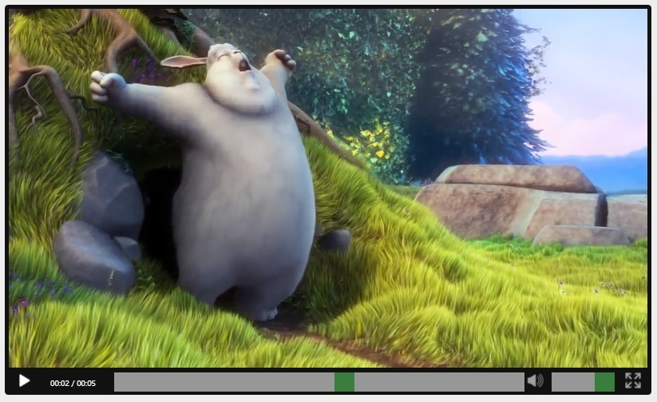
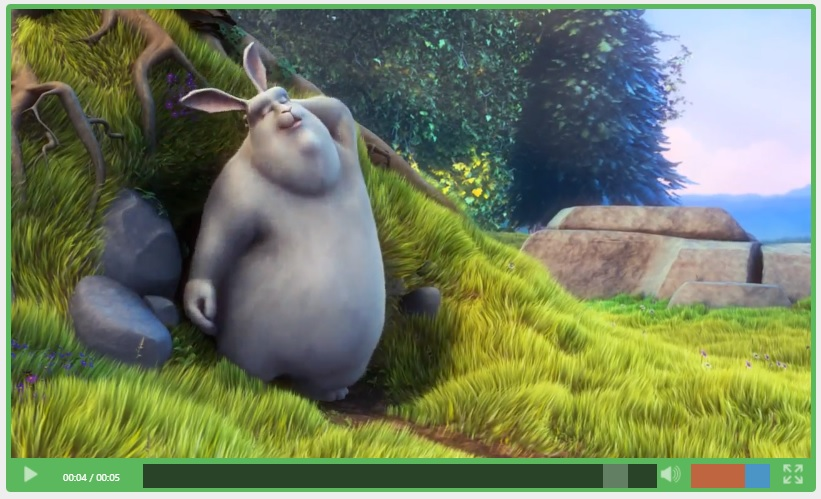

# PersianVideoPlayer
Customized Video Player in html
By Hossein Badrnezhad



how to Install :
---
in html file :

in header =>
```html
<link href="css/PersianVideoPlayer.min.css" rel="stylesheet" />
```
in body =>
```html
<video id="MyVideoPlayer" preload="metadata" poster="src/SampleVideo.jpg" style="width:800px;">
    <source src="src/SampleVideo.mp4" type="video/mp4">
</video>
```
in footer =>
```html
<script src="js/jquery-1.10.2.min.js"></script>
<script src="js/PersianVideoPlayer.min.js"></script>
<script>
  $(document).ready(function () {
    PersianPlayer("MyVideoPlayer");
  });
</script>
```

adding options :

```html
<script>
  $(document).ready(function () {
    PersianPlayer("MyVideoPlayer", {
        padding: "5px",
        borderRadius: "5px",
        backgroundColor: "#5CB85C",
        seekBackground: "#111",
        seekColor: "#666",
        volumeColor: "#4285F4",
        volumeBackground: "#EA4335"
     });
  });
</script>
```

more options :

```js
padding: "5px",
backgroundColor: "#111",
borderRadius: "5px",
volumeBackground: "#D1D1D1",
volumeColor: "#4BAD4F",
seekBackground: "#D1D1D1",
seekColor: "#4BAD4F",
playButton: 'data:image/png;base64,...',
pauseButton: 'data:image/png;base64,...',
muteButton: 'data:image/png;base64,...',
unmuteButton: 'data:image/png;base64,...',
fullscreenButton: 'data:image/png;base64,...'
```


